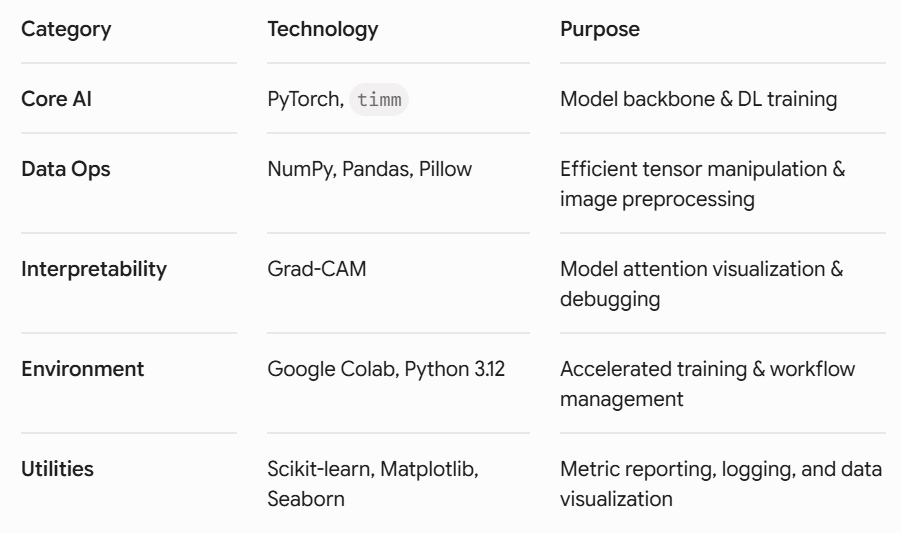

AetherVision: Intelligent Weather Classification System 🌦️
AetherVision is a high-performance computer vision framework designed to classify meteorological conditions with precision. Leveraging Vision Transformers (ViT) and custom Focal Loss optimization, the system achieves state-of-the-art accuracy in handling imbalanced environmental datasets.

🚀 Key Features
State-of-the-Art Architecture: Powered by timm (PyTorch Image Models) using pre-trained Vision Transformers for global contextual awareness.

Imbalance Mitigation: Implements custom Focal Loss to ensure robust performance on minority weather classes.

Interpretability: Built-in Grad-CAM integration to visualize model attention and debug feature identification.

Production-Ready Pipeline: Optimized data loaders with seamless support for large-scale image processing and hardware acceleration (CUDA).

📊 Results & Visualization
The AetherVision system has been optimized to ensure high-fidelity classification and reliable feature identification. Below is the performance trajectory of the model and a sample visualization of its decision-making process.

Performance Metrics: The graph above illustrates the model's convergence, showing minimal divergence between training and validation loss, confirming the system's ability to generalize to unseen data.

Interpretability: Using Grad-CAM, we can visualize the model's attention. The heatmap below highlights how the Vision Transformer (ViT) effectively isolates meteorological features, ignoring extraneous background noise.

 

📋 Project Structure
AetherVision/
├── data/
│   └── raw/
│       ├── test_dataset/
│       └── train_dataset/
│           ├── train_images/
│           └── train.json
├── notebooks/
│   └── exploration.ipynb
├── src/
│   ├── __init__.py
│   ├── data_loader.py
│   ├── gradcam.py
│   ├── loss.py
│   └── model.py
├── .gitignore
├── image.png
├── main.py
├── README.md
└── requirements.txt

🏗️ Technical Stack
This stack highlights your proficiency in deep learning, data engineering, and model interpretability.

🚀 Getting Started
This project is optimized for high-performance computing. Because training Vision Transformers (ViT) on local hardware can be time-prohibitive, this workflow is designed to run seamlessly on Google Colab with a T4 GPU.
1. Clone the Repository:
git clone https://github.com/Anisca-hub/AetherVision.git
cd AetherVision

2. Install Dependencies:
pip install -r requirements.txt

3. Run the Pipeline:
Execute the main entry point to start training or evaluation:
python main.py

🎓 About the Author
Built by [Anisca Jha] | [https://www.linkedin.com/in/anisca-jha-93ba83308]

Designed to showcase excellence in modern AI development, AetherVision implements high-performance Vision Transformers (ViT) and sophisticated interpretability modules (Grad-CAM). The project serves as a blueprint for robust machine learning workflows, emphasizing modular data engineering, hardware-accelerated training, and verifiable, reproducible model performance.